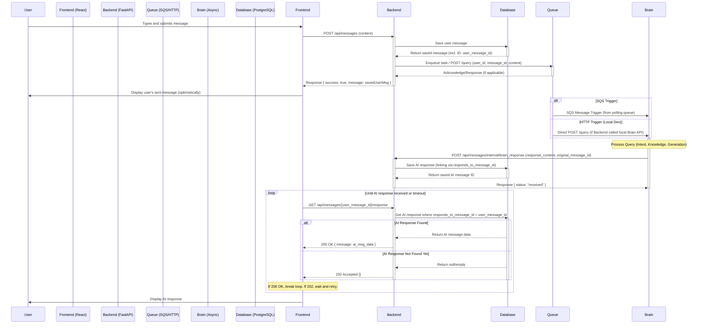

# Project Context

This document provides a high-level overview of the Curiosity Coach project architecture and key workflows to help orient developers and AI assistants.

## Overview

Curiosity Coach is a modern chatbot application featuring a React frontend (TypeScript) and a FastAPI backend (Python). It aims to provide an interactive and engaging chat experience where user messages are processed asynchronously by a dedicated "Brain" component to generate thoughtful AI responses. The system utilizes PostgreSQL for data persistence and offers flexibility in development by supporting both AWS SQS and a local HTTP endpoint for task queuing between the backend and the Brain.

## Architecture

The project follows a typical web application architecture with distinct frontend, backend, and asynchronous processing components.

### Components

*   **Frontend:** React (TypeScript) application (`curiosity-coach-frontend/`) using standard React features (components, context, likely hooks for state management).
*   **Backend:** FastAPI (Python) application (`backend/`) handling API requests, user identification, message persistence, and task queuing. Uses SQLAlchemy as the ORM.
*   **Queue:** Decouples backend from Brain. Uses AWS SQS in production/staging, or a direct HTTP call (via `httpx`) to a local Brain endpoint during development (`APP_ENV=development` and `LOCAL_BRAIN_ENDPOINT_URL` set).
*   **Brain:** Asynchronous Python worker (`Brain/`) responsible for processing user messages received from the queue. Executes a pipeline involving intent identification, knowledge retrieval, potential learning/enhancement steps, and final response generation, leveraging an LLM via `llm_service.py`.
*   **Database:** PostgreSQL (`backend/src/models.py`, `backend/schema.sql`) storing `User` (identified by phone number) and `Message` data, including the relationship between user messages and AI responses.

### Interaction Flow

The following diagram illustrates the core flow for sending a message and receiving an AI response:



**Key Steps & Endpoints:**
1.  User sends message via Frontend.
2.  Frontend POSTs to Backend: `/api/messages`.
3.  Backend saves user message to PostgreSQL (`User`, `Message` tables) via SQLAlchemy models (`backend/src/models.py`).
4.  Backend determines queue mechanism (SQS or Local HTTP) based on environment variables (`APP_ENV`, `LOCAL_BRAIN_ENDPOINT_URL`).
5.  Backend sends task to Queue (SQS message or POST to `LOCAL_BRAIN_ENDPOINT_URL/query`) containing user/message details (`backend/src/queue/service.py`).
6.  Brain worker receives task (via SQS polling or HTTP POST).
7.  Brain executes processing pipeline (`Brain/src/core/` modules: intent, knowledge, generation using `Brain/src/services/llm_service.py`).
8.  Brain POSTs AI response to Backend: `/api/messages/internal/brain_response`.
9.  Backend saves AI response to PostgreSQL, linking it to the original user message (`responds_to_message_id`).
10. Frontend periodically polls Backend: `GET /api/messages/{user_message_id}/response`.
11. Backend checks database for the linked AI response. Returns `200 OK` with the response if found, or `202 Accepted` if still processing.
12. Frontend displays AI response upon receiving `200 OK`.

## Key Directories & Files

*   `curiosity-coach-frontend/`: Contains the React frontend code.
    *   `src/`: Main source folder (components, context, services, etc.).
    *   `package.json`: Node.js dependencies and scripts.
    *   `README.md`: Frontend-specific documentation.
*   `backend/`: Contains the FastAPI backend code.
    *   `src/`: Main source folder.
        *   `main.py`: FastAPI app entrypoint.
        *   `models.py`: SQLAlchemy data models (User, Message).
        *   `database.py`: Database session management.
        *   `config/settings.py`: Pydantic-based environment variable loading.
        *   `auth/`: User identification logic (phone number based).
        *   `messages/`: API routes for messages.
        *   `queue/`: Service for sending tasks to SQS/Local HTTP.
    *   `alembic/`: Database migration scripts.
    *   `requirements.txt`: Python dependencies.
    *   `run.sh`: Script to run the backend server.
    *   `README.md`: Backend-specific documentation.
*   `Brain/`: Contains the asynchronous message processing logic.
    *   `src/`: Main source folder.
        *   `main.py`: Potential entrypoint for local HTTP server.
        *   `process_query_entrypoint.py`: Main logic handler for received tasks.
        *   `lambda_function.py`: Handler for AWS Lambda deployment.
        *   `core/`: Core processing steps (intent, knowledge, generation).
        *   `services/`: External service integrations (e.g., `llm_service.py`).
        *   `prompts/`: Likely contains templates for LLM interaction.
    *   `config/llm_config.json`: Configuration specific to the LLM.
    *   `requirements.txt`: Python dependencies for the Brain.
    *   `Dockerfile`: Container definition.
*   `terraform/`: Infrastructure-as-Code definitions (`main.tf`, `variables.tf`) likely for deploying AWS resources (e.g., SQS, Lambda, potentially ECS/EC2, IAM roles).
*   `run_dev.sh`: Script to start both frontend and backend development servers.
*   `kill_servers.sh`: Script to stop development servers.
*   `README.md`: Project-level overview and setup instructions.

## Core Workflows

*   **User Messaging:** Described in the Interaction Flow diagram and Key Steps above.
*   **User Identification/Authentication:** Simple identification via phone number. Frontend sends phone number to `/api/auth/login`. Backend's `auth_service` uses `get_or_create_user` (`backend/src/models.py`) to find or create a user record in the database based on the phone number. No session management or explicit logout seems present in the core router.
*   **Brain Processing Pipeline:** Triggered by message queue task. Involves:
    1.  `intent_identifier.py`: Determine the purpose or category of the user's message.
    2.  `knowledge_retrieval.py`: Fetch relevant information based on the intent/query.
    3.  `learning_enhancement.py`: Potentially modify retrieved knowledge or adapt based on context.
    4.  `final_response_generator.py`: Use the processed information and context (likely involving `llm_service.py`) to craft the final AI response.
*   **Configuration Management:** Primarily uses environment variables loaded via Pydantic `BaseSettings` in the backend (`backend/src/config/settings.py`) from `.env.local` or `.env`. Key vars include `APP_ENV`, `DB_*`, `AWS_*`, `SQS_QUEUE_URL`, `LOCAL_BRAIN_ENDPOINT_URL`. The Brain uses Python environment variables and potentially `Brain/config/llm_config.json`.
*   **Error Handling:** Basic error handling is visible (e.g., `try...except` blocks in `queue_service.py`, HTTPExceptions in FastAPI routers), but comprehensive strategies across components (retries, dead-letter queues for SQS, detailed API error responses) are not explicitly documented here.

## Data Models

The primary data models are defined in `backend/src/models.py` using SQLAlchemy:
*   **User:** Stores user information.
    *   `id` (Integer, PK)
    *   `phone_number` (String, Unique)
    *   `created_at` (DateTime)
*   **Message:** Stores individual chat messages.
    *   `id` (Integer, PK)
    *   `user_id` (Integer, FK to User)
    *   `content` (Text)
    *   `is_user` (Boolean) - True if message is from the user, False if from the AI.
    *   `timestamp` (DateTime)
    *   `responds_to_message_id` (Integer, FK to Message, nullable) - Links an AI response (`is_user=False`) back to the user message (`is_user=True`) it answers.
    *   Relationships: Many-to-one with `User`. Self-referential via `responds_to_message_id`.

## Setup & Run

Refer to the main `README.md` for detailed prerequisites (Node.js, Python, PostgreSQL) and setup steps.

**Basic Steps:**

1.  **Setup PostgreSQL:** Create the `curiosity_coach` database.
2.  **Backend Setup:**
    ```bash
    cd backend
    # Create/activate virtualenv
    pip install -r requirements.txt
    # Configure .env.local (copy from .env.example)
    ```
3.  **Frontend Setup:**
    ```bash
    cd ../curiosity-coach-frontend
    npm install
    ```
4.  **Run:**
    *   **Option 1 (Combined):** From the project root: `./run_dev.sh`
    *   **Option 2 (Separate):**
        *   Terminal 1: `cd backend && ./run.sh`
        *   Terminal 2: `cd curiosity-coach-frontend && npm start`

**Access:**
*   Frontend: `http://localhost:3000`
*   Backend: `http://localhost:5000`

**Stopping:**
*   `Ctrl+C` in the terminal where `./run_dev.sh` is running.
*   Or, from the project root: `./kill_servers.sh`

**Environment Variables:** Ensure necessary environment variables are set in `backend/.env.local` (for development) or the deployment environment, including database credentials, AWS details (if using SQS), and potentially `LOCAL_BRAIN_ENDPOINT_URL` for local development.

## Deployment

*   Infrastructure is likely managed via Terraform (`terraform/` directory).
*   The Brain component has a `Dockerfile` and `lambda_function.py`, suggesting potential deployment targets like AWS Lambda or container services (ECS, EKS, etc.).
*   The Backend (FastAPI) and Frontend (React) would typically be deployed to services like AWS App Runner, ECS, EC2, or managed platform equivalents.

## Testing

*   Frontend includes basic test setup (`App.test.tsx`, `setupTests.ts`).
*   The Brain component has signs of testing (`test_lambda_function.py` mentioned in root README, although not listed in directory exploration).
*   Backend testing infrastructure isn't immediately obvious from the file structure but might exist.
*   Running tests likely involves standard commands (`npm test` for frontend, `pytest` or `unittest` for backend/brain). 