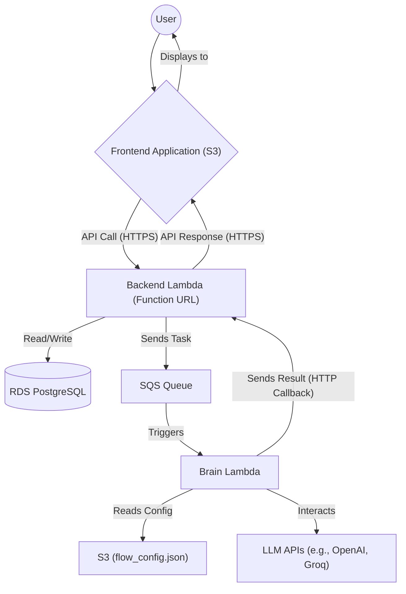
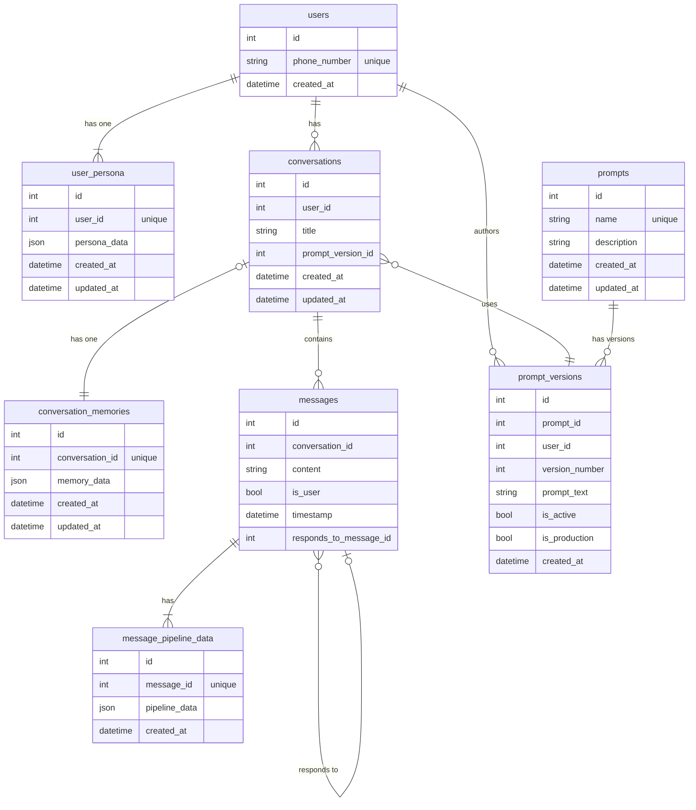
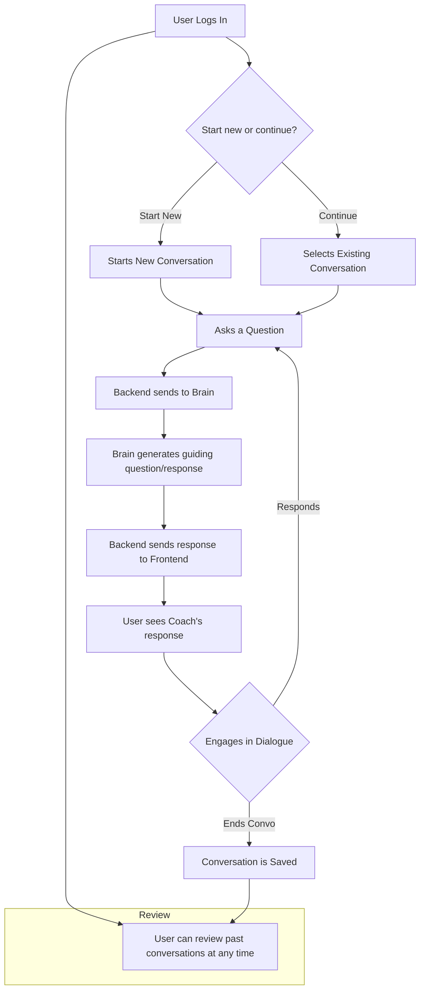
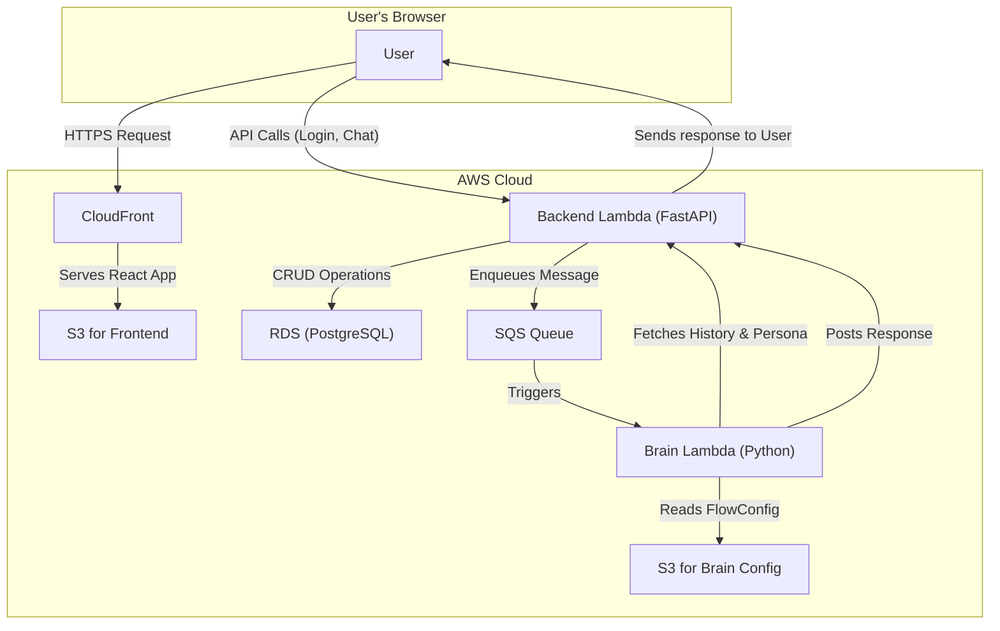
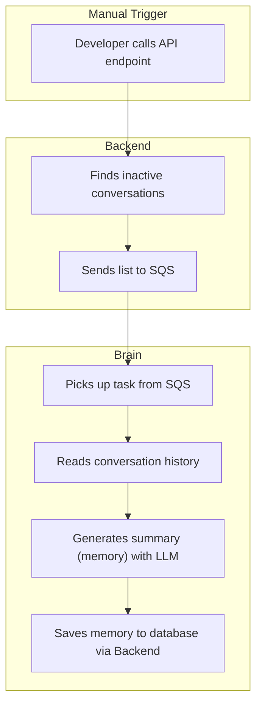
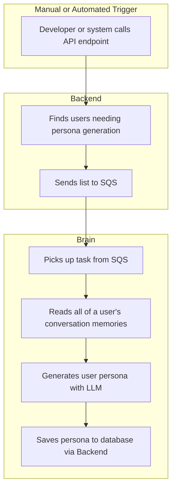

# Technical Explanation

This document provides a technical overview of the Curiosity Coach project.

## Project Overview

The Curiosity Coach project is a conversational AI application designed to help students learn by fostering curiosity. It consists of a frontend, a backend, and a "Brain" service.

## Architecture

The project follows a microservices architecture, with three main components:

1.  **Frontend:** A React application that provides the user interface for the chat.
2.  **Backend:** A FastAPI application that handles user authentication, conversation management, and acts as a gateway to the Brain service.
3.  **Brain:** A Python service that is responsible for processing user messages and generating responses.

The services are deployed on AWS using Terraform.

### High-Level System Diagram

## Services

### 1. Frontend (`curiosity-coach-frontend/`)

*   **Technology:** React, TypeScript, Tailwind CSS, Material UI.
*   **Functionality:**
    *   User login (phone number based).
    *   Real-time chat interface for conversations with the AI.
    *   Message history persistence.
    *   Interface for testing different prompts.
    *   Interface for viewing different versions of prompts.
*   **Infrastructure:**
    *   Hosted on an S3 bucket.
    *   Served by a CloudFront distribution.
    *   DNS managed by Cloudflare.

### 2. Backend (`backend/`)

*   **Technology:** Python 3.9+, FastAPI, PostgreSQL, SQLAlchemy, Alembic for migrations, `uv` for package management. Uses Mangum to run on AWS Lambda.
*   **Key Libraries:** `fastapi`, `uvicorn`, `sqlalchemy`, `psycopg2-binary`, `alembic`, `pydantic`, `boto3`, `mangum`, `python-dotenv`, `passlib`, `python-jose`.
*   **Functionality:**
    *   User authentication (phone number based).
    *   CRUD operations for users, conversations, messages, prompts, prompt versions, memories, and user personas.
    *   An endpoint (`/api/tasks/trigger-memory-generation`) to initiate memory generation for recently ended conversations.
    *   An endpoint (`/api/tasks/trigger-user-persona-generation`) to initiate persona generation for users.
    *   Forwards user messages to the Brain service via an SQS queue and enqueues batch tasks for memory and persona generation.
    *   Receives responses from the Brain service via an HTTP callback.
    *   Locally, the backend can talk directly to the Brain service, bypassing SQS.
*   **Infrastructure:**
    *   Runs as a Docker container on AWS Lambda.
    *   Exposed via a Lambda Function URL.
    *   Uses an RDS for PostgreSQL database.
    *   Uses an SQS queue to communicate with the Brain service.

### 3. Brain (`Brain/`)

*   **Technology:** Python 3.11, FastAPI (for local development). Uses Mangum to run on AWS Lambda.
*   **Key Libraries:** `fastapi`, `uvicorn`, `jinja2`, `requests`, `httpx`, `python-dotenv`, `groq`, `openai`, `mangum`, `boto3`, `pydantic`.
*   **Functionality:**
    *   Processes user messages to generate intelligent responses.
    *   Handles asynchronous batch jobs from SQS, such as generating structured memories from conversation histories and creating user personas from those memories.
    *   Uses a configurable pipeline of steps to process messages, defined in a `flow_config.json` file stored in S3.
        *   **Intent Gathering:** Determines the user's intent.
        *   **Knowledge Retrieval:** Retrieves relevant information.
        *   **Response Generation:** Generates a response.
        *   **Learning Enhancement:** Adds elements to foster curiosity.
    *   The memory generation process uses an LLM to summarize conversations.
    *   Communicates with the backend to get conversation history and user personas, and sends back responses via HTTP callback.
*   **Infrastructure:**
    *   Runs as a Docker container on AWS Lambda.
    *   Triggered by messages from the SQS queue from the backend.
    *   Can also be invoked via a Lambda Function URL for testing and configuration.
    *   Stores its `flow_config.json` in an S3 bucket.

## Database Schema

The backend uses a PostgreSQL database with the following tables:

*   `users`: Stores user information (phone number).
*   `conversations`: Stores conversation metadata (user, title, etc.).
*   `conversation_memories`: Stores structured summaries of conversations, generated by the Brain.
*   `user_persona`: Stores a structured JSON object summarizing a user's interests and learning style, generated by the Brain from their memories.
*   `messages`: Stores the messages in each conversation.
*   `message_pipeline_data`: Stores additional data about the message processing pipeline from the Brain service.
*   `prompts`: Stores different types of prompts used by the Brain service.
*   `prompt_versions`: Stores different versions of each prompt.

### Database Schema Diagram

---

# Developer Guide

This section contains information for developers to set up, run, test, and deploy the project.

## Local Development Setup

Each service (`frontend`, `backend`, `Brain`) contains a `run.sh` script to automate the setup and execution for local development.

### 1. Backend (`backend/`)
-   **Setup:**
    -   Navigate to the `backend/` directory.
    -   Create a `.env.local` file from the example. This file holds database credentials and other environment variables.
    -   Run `chmod +x run.sh`.
-   **Running:**
    -   Execute `./run.sh`.
    -   This script uses `uv` to create a virtual environment in `./venv`, installs dependencies from `requirements.lock`, and starts the FastAPI server on port 5000.

### 2. Brain (`Brain/`)
-   **Setup:**
    -   Navigate to the `Brain/` directory.
    -   Create a `src/.env` file. This file holds API keys for LLM services (OpenAI, Groq) and the backend callback URL.
    -   Run `chmod +x run.sh`.
-   **Running:**
    -   Execute `./run.sh`.
    -   This script uses `pip` to create a virtual environment in `./venv`, installs dependencies from `requirements.txt`, and starts the FastAPI server on port 8000.

### 3. Frontend (`curiosity-coach-frontend/`)
-   **Setup:**
    -   Navigate to the `curiosity-coach-frontend/` directory.
    -   Run `npm install` to install dependencies.
-   **Running:**
    -   Run `npm start` to start the React development server.

### Running All Services
You can start all services (Frontend, Backend, and Brain) concurrently using the "Start All Servers" task defined in `.vscode/tasks.json`, executable via the VS Code task runner.

## Database Migrations (Alembic)

The backend service uses Alembic to manage database schema changes.

1.  **Activate Environment:** `source backend/venv/bin/activate`
2.  **Apply Migrations:** To upgrade the database to the latest version, run `alembic upgrade head` from the `backend/` directory.
3.  **Create a New Migration:** After changing SQLAlchemy models in `src/models.py`, run `alembic revision -m "description" --autogenerate` to create a new migration script. Review the script before applying it.

## End-to-End Testing (`tests/`)

The project includes an E2E test suite that runs against the locally-hosted services.

1.  **Setup:**
    -   `cd tests`
    -   Create and activate a Python virtual environment: `python3 -m venv venv && source venv/bin/activate`.
    -   Install dependencies: `pip install -r requirements.txt`.
    -   Create a `.env` file from the example and fill in database credentials.
2.  **Running Tests:**
    -   Ensure the `Backend` and `Brain` services are running locally.
    -   Run `pytest -v` from the `tests/` directory.
    -   The test suite automatically handles database setup and synchronization.

## Infrastructure (Terraform)

The entire cloud infrastructure is managed using Terraform in the `terraform/` directory.

-   **Key Files:**
    -   `frontend.tf`: S3 bucket and CloudFront distribution for the frontend.
    -   `backend.tf`: Lambda, RDS, ECR, and SQS for the backend.
    -   `brain.tf`: Lambda, ECR, and S3 for the Brain.
    -   `variables.tf`: Common variables.
-   **Deployment:**
    -   Navigate to the `terraform/` directory.
    -   Run `terraform init`, `terraform plan`, and `terraform apply`.
-   **Cloudflare for Custom Domain:**
    -   The `README-cloudflare.md` file provides instructions for setting up a custom domain for the CloudFront distribution using Cloudflare. This involves creating a `terraform.tfvars` file with your Cloudflare API key, email, and zone ID.

---

# Non-Technical Product Overview

This document provides a non-technical overview of the Curiosity Coach project, intended for a product manager or other non-technical stakeholders.

## Product Vision

The Curiosity Coach is an AI-powered learning companion that helps students explore their interests and develop critical thinking skills. Instead of just providing answers, the Curiosity Coach engages students in a conversation, asks thought-provoking questions, and encourages them to think for themselves.

### User Flow Diagram

## User Flow

The primary user flow is a conversation with the Curiosity Coach. Here's a typical scenario:

1.  **Login:** A student logs in to the application using their phone number.
2.  **Start a Conversation:** The student starts a new conversation or continues an existing one.
3.  **Ask a Question:** The student asks a question about a topic they are interested in.
4.  **Engage in a Dialogue:** The Curiosity Coach responds not with a direct answer, but with a question or a prompt to encourage the student to think more deeply about the topic. For example, if a student asks "Why is the sky blue?", the coach might respond with "That's a great question! What do you think makes the sky blue?".
5.  **Explore and Learn:** The conversation continues in this manner, with the coach guiding the student to discover the answer for themselves. The coach might provide analogies, examples, or break down complex topics into smaller pieces.
6.  **Conversation History:** All conversations are saved, so the student can review them later.

## Key Features

*   **Conversational Learning:** The core of the product is the conversational interface that promotes active learning.
*   **Personalized Experience:** The coach can adapt to the student's level of understanding and interests.
*   **Conversation Memory:** The system can summarize completed conversations to build a structured memory. This provides valuable insights into the student's learning journey and can be used to personalize future interactions.
*   **User Persona Generation:** The system analyzes a user's conversation memories to create a "persona," which is a summary of their interests, learning style, and preferences. This allows for an even more tailored and effective learning experience over time.
*   **Prompt and Version Management:** The system allows for sophisticated management of the prompts that guide the AI.
    *   **What are Prompts?** Prompts are the instructions and templates that the AI uses to generate its responses. We have different prompts for different tasks, such as the main conversational prompt or a prompt for summarizing conversations.
    *   **Versioning:** Instead of overwriting a prompt when we want to make a change, we create a new version. This gives us a complete history of all changes, allows us to test different wordings, and lets us switch between versions easily.
    *   **Editing and Creating Versions:** A special interface allows authorized users to edit the text of a prompt and save it as a new version.
    *   **Active vs. Production Versions:** The system supports both an "active" and a "production" version for a prompt. The "active" version is used for testing and development, allowing us to try out new ideas without affecting live users. The "production" version is the one that real users interact with, ensuring a stable and consistent experience. An administrator can designate a specific version as "production."
*   **Configurable "Brain":** The "Brain" of the coach is highly configurable. We can change its behavior by adjusting a `FlowConfig` file, allowing us to experiment with different conversational strategies without changing the code.

## How the Pieces Connect

1.  A student sends a message from the **Frontend** (the React app).
2.  The **Backend** (the FastAPI app) receives the message, saves it to the database, and sends it to the **Brain** service.
3.  The **Brain** service processes the message, using its prompts and configuration to decide on the best response.
4.  The **Brain** sends the response back to the **Backend**.
5.  The **Backend** saves the response to the database and sends it to the **Frontend**.
6.  The **Frontend** displays the response to the student.

This cycle continues for the entire conversation.

### Component Connection Diagram (Chat)

### Component Connection Diagram (Memory Generation)

In addition to the real-time chat flow, there is an asynchronous, manually-triggered process to create memories from conversations.

### Component Connection Diagram (User Persona Generation)

Similar to memory generation, there is an asynchronous, triggerable process to create user personas from their conversation memories.

This overview should provide a good understanding of the Curiosity Coach project from a product perspective.