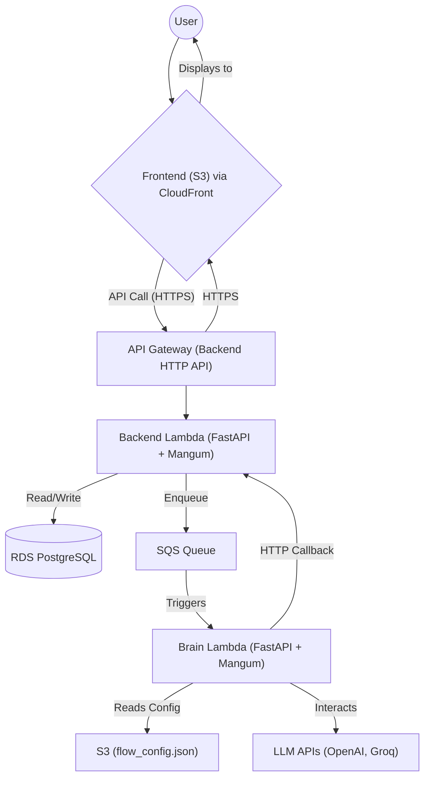
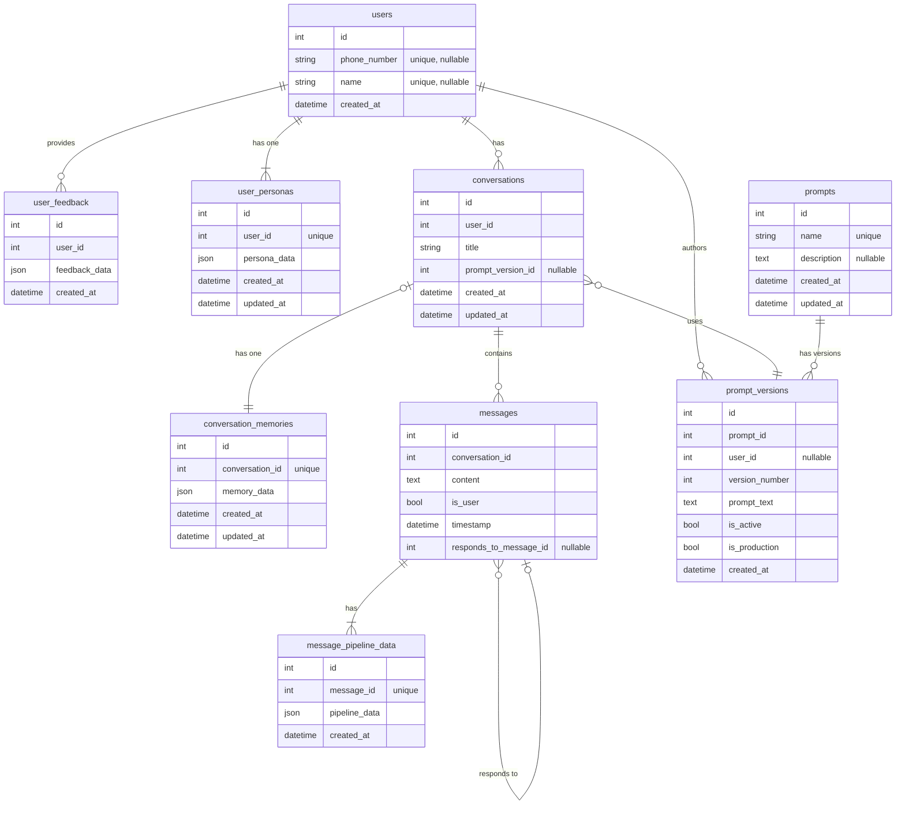
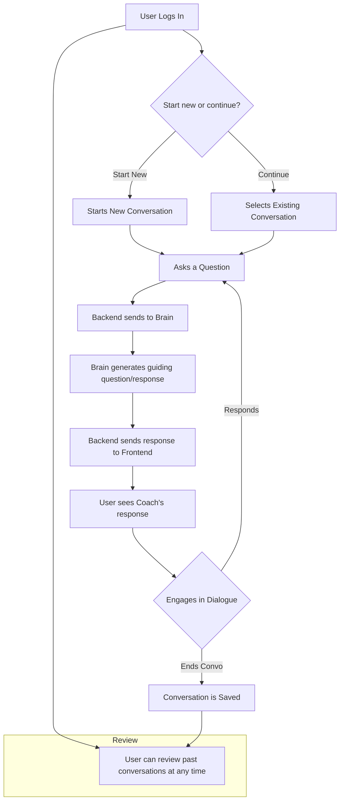
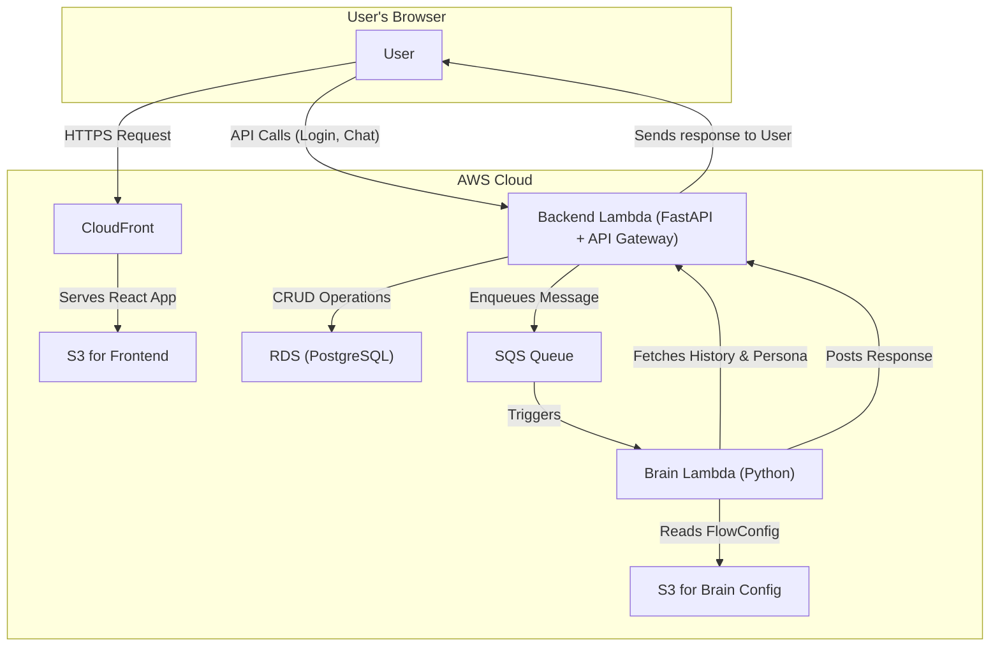
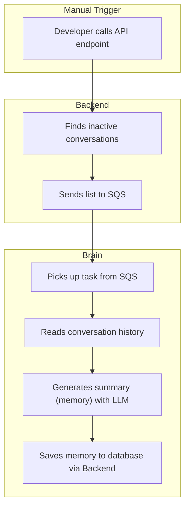
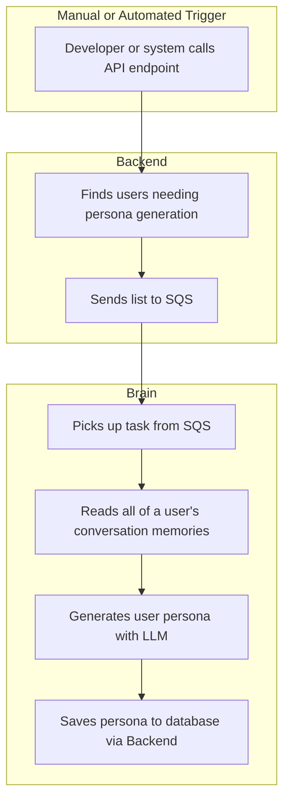

# Curiosity Coach - Project Context Document

**Last Updated:** October 2, 2025

This document provides a comprehensive technical and non-technical overview of the Curiosity Coach project for AI coding agents and human engineers.

---

## Quick Start for AI Agents & Engineers

### What is Curiosity Coach?
A conversational AI tutoring system for students (grades 5-10) that fosters learning through curiosity rather than direct answers.

### Core Architecture
```
┌──────────────┐      ┌─────────────┐      ┌──────────────┐
│   Frontend   │─────▶│   Backend   │─────▶│    Brain     │
│  (React +    │◀─────│  (FastAPI + │◀─────│  (FastAPI +  │
│   TypeScript)│      │  PostgreSQL)│      │   LLMs)      │
└──────────────┘      └─────────────┘      └──────────────┘
   Port 3000            Port 5000            Port 8000/8001
   S3 + CloudFront     Lambda + RDS        Lambda + S3
```

### Quick Setup (Local Development)

1. **Get Environment Files** from another developer:
   - `backend/.env.local`
   - `Brain/src/.env`
   - `curiosity-coach-frontend/.env.local`

2. **Start Services**:
   ```bash
   # Terminal 1 - Backend
   cd backend && ./run.sh
   
   # Terminal 2 - Brain
   cd Brain && ./run.sh
   
   # Terminal 3 - Frontend
   cd curiosity-coach-frontend && npm install && npm start
   ```

3. **Access**:
   - Frontend: http://localhost:3000
   - Backend API: http://localhost:5000/api/docs
   - Brain: http://localhost:8000

### Key Concepts to Understand

**Prompt Versioning:** Each prompt has multiple versions. "Active" = testing, "Production" = live users.

**Conversation Memory:** Auto-generated structured summaries of conversations (main_topics, action, typical_observation).

**User Persona:** Generated profile based on user's conversation memories.

**Message Flow:** User → Backend → SQS/HTTP → Brain (LLM processing) → HTTP callback → Backend → Poll → User

**Placeholders:** `{{CONVERSATION_MEMORY}}`, `{{USER_PERSONA}}` inject dynamic context into prompts.

### Common Development Tasks

**Run tests:**
```bash
cd tests && source venv/bin/activate && pytest -v
```

**Database migrations:**
```bash
cd backend && alembic upgrade head
```

**Sync production DB to local:**
```bash
cd backend && python scripts/sync_prod_to_local.py
```

**Deploy infrastructure:**
```bash
cd terraform && terraform apply
```

**View logs:**
```bash
cd terraform && ./get_latest_logs_cloudwatch.sh
```

### Important File Locations

- **Backend Models:** `backend/src/models.py` - All SQLAlchemy models
- **API Endpoints:** `backend/src/*/router.py` files
- **Brain Core Logic:** `Brain/src/process_query_entrypoint.py`
- **Main Prompt:** `Brain/src/prompts/simplified_conversation_prompt.txt`
- **Memory Generation:** `Brain/src/prompts/memory_generation_prompt.txt`
- **Infrastructure:** `terraform/*.tf` files

### Troubleshooting

**"Connection refused" errors:** Ensure all services are running and ports are correct.

**Database errors:** Check `.env.local` credentials, run migrations, or sync from prod.

**Brain not responding:** Verify LLM API keys in `Brain/src/.env`.

**Tests failing:** Ensure Backend and Brain services are running locally.

---

## Project Overview

**Curiosity Coach** is a conversational AI application designed to help students in grades 5-10 learn by fostering curiosity, critical thinking, and active learning. Instead of providing direct answers, the coach engages students in thought-provoking conversations that guide them to discover knowledge themselves. The application consists of three main components: a React-based Frontend, a FastAPI Backend, and an AI-powered Brain service.

## Architecture

The project follows a microservices architecture, with three main components:

1.  **Frontend:** A React application that provides the user interface for the chat.
2.  **Backend:** A FastAPI application that handles user authentication, conversation management, and acts as a gateway to the Brain service.
3.  **Brain:** A Python service that is responsible for processing user messages and generating responses.

The services are deployed on AWS using Terraform.

### High-Level System Diagram



## Services

### 1. Frontend (`curiosity-coach-frontend/`)

*   **Technology:** React 19.1.0, TypeScript, Tailwind CSS 3.4, Material UI 7.0, Axios, React Router DOM 7.5
*   **Port:** Runs on port 3000 in development
*   **Key Features:**
    *   **Multi-mode Authentication:** Identifier-based login supporting both phone numbers and names (names get auto-generated 3-digit suffixes for uniqueness)
    *   **Real-time Chat Interface:** Conversational UI with message history and polling for AI responses
    *   **Conversation Management:** Create, view, edit titles, and delete conversations via sidebar
    *   **Test Prompt Mode:** Special interface for testing prompts using active (non-production) versions
    *   **Prompt Version Management:** View, edit, create new prompt versions, and set active/production versions
    *   **Memory & Persona Viewing:** Modals to view conversation memories and user personas (if available)
    *   **Pipeline Steps Viewer:** View detailed pipeline processing data for AI responses
    *   **User Feedback:** Modal interface for thumbs up/down feedback with optional text comments
    *   **Brain Configuration:** Interface to view and modify FlowConfig (processing pipeline configuration)
*   **Main Components:**
    *   `Login.tsx` - Authentication page
    *   `ChatInterface/` - Main chat UI with header, message list, input, and modals
    *   `ConversationSidebar.tsx` - Conversation list and management
    *   `PromptVersionsView.tsx` - Prompt management interface
    *   `BrainConfigView.tsx` - FlowConfig editor
    *   `FeedbackModal.tsx` - User feedback collection
    *   `MemoryViewModal.tsx` - Display conversation memory
    *   `PipelineStepsModal.tsx` - Show AI processing details
*   **Infrastructure:**
    *   Hosted on an S3 bucket as static website
    *   Served via CloudFront distribution with SSL
    *   DNS managed by Cloudflare (custom domain support)
    *   Build folder contains optimized production assets

### 2. Backend (`backend/`)

*   **Technology:** Python 3.9+, FastAPI 0.115+, SQLAlchemy 2.0, Alembic (migrations), PostgreSQL 14+
*   **Port:** Runs on port 5000 in development
*   **Environment Manager:** Uses `uv` for fast package management and virtual environment creation
*   **Key Libraries:** 
    *   `fastapi`, `uvicorn[standard]==0.23.2` - Web framework and ASGI server
    *   `sqlalchemy==2.0.23`, `psycopg2-binary==2.9.9` - Database ORM and PostgreSQL adapter
    *   `alembic` - Database migrations
    *   `pydantic==2.11.3`, `pydantic-settings==2.9.1` - Data validation and settings
    *   `boto3==1.28.57` - AWS SDK (SQS, S3)
    *   `mangum` - Lambda adapter for FastAPI
    *   `httpx` - Async HTTP client
    *   `passlib[bcrypt]`, `python-jose[cryptography]` - Password hashing and JWT
    *   `python-dotenv==1.0.0` - Environment variable management
*   **Core Functionality:**
    *   **Authentication:** Identifier-based (phone or name) with Bearer token (currently uses user_id)
    *   **User Management:** Create/get users by phone or name (names get unique 3-digit suffixes)
    *   **Conversation CRUD:** Create, read, update titles, delete conversations
    *   **Message Management:** Send messages, poll for AI responses, retrieve conversation history
    *   **Prompt Versioning System:** 
        *   Manage prompts with multiple versions
        *   Active vs Production versions (active for testing, production for live users)
        *   Track version authors and creation times
    *   **Conversation Memory:** 
        *   Store structured summaries of conversations (main_topics, action, typical_observation)
        *   Generate memories for inactive conversations automatically
        *   Internal endpoints for Brain to read memories
    *   **User Personas:** 
        *   Generate and store user personas based on conversation memories
        *   Single persona per user (1:1 relationship)
        *   Internal endpoints for Brain to read personas
    *   **User Feedback:** Store user feedback with thumbs up/down and optional text
    *   **Pipeline Data:** Store detailed AI processing steps for each message
    *   **Task Management:** 
        *   Trigger memory generation (batch, per-conversation, per-user)
        *   Trigger persona generation (batch, per-user)
        *   Support both sync (local) and async (SQS) modes
*   **Communication Patterns:**
    *   **To Brain:** 
        *   Production: Sends messages via SQS queue
        *   Local Dev: Direct HTTP POST to `LOCAL_BRAIN_ENDPOINT_URL` (e.g., `http://127.0.0.1:8001`)
    *   **From Brain:** Receives AI responses via HTTP callback at `/api/internal/brain_response`
*   **Infrastructure:**
    *   **Local:** FastAPI server with direct PostgreSQL connection
    *   **Production:** 
        *   Dockerized FastAPI app on AWS Lambda (via Mangum adapter)
        *   Exposed via API Gateway HTTP API
        *   RDS PostgreSQL instance (or shared existing instance)
        *   SQS queue for Brain communication
        *   VPC configuration for secure database access
*   **Database Scripts:**
    *   `scripts/sync_prod_to_local.py` - Complete database sync from production to local (with safety checks)
*   **Project Structure:**
    *   `src/main.py` - FastAPI app entry point with CORS and router registration
    *   `src/models.py` - SQLAlchemy models and CRUD helper functions
    *   `src/database.py` - Database session and engine setup
    *   `src/config/settings.py` - Configuration management via Pydantic
    *   `src/auth/` - Authentication logic and schemas
    *   `src/conversations/` - Conversation endpoints
    *   `src/messages/` - Message endpoints and service
    *   `src/prompts/` - Prompt versioning endpoints and service
    *   `src/memories/` - Conversation memory endpoints and CRUD
    *   `src/user_personas/` - User persona endpoints and CRUD
    *   `src/tasks/` - Task trigger endpoints
    *   `src/internal/` - Internal endpoints for Brain service
    *   `src/feedback/` - User feedback endpoints
    *   `src/health/` - Health check endpoints
    *   `src/queue/` - SQS queue service

### 3. Brain (`Brain/`)

*   **Technology:** Python 3.11, FastAPI (local), Mangum (Lambda), Jinja2 (templates)
*   **Port:** Runs on port 8000 (or 8001) in development
*   **Environment Manager:** Uses `pip` with standard venv
*   **Key Libraries:** 
    *   `fastapi`, `uvicorn[standard]` - Web framework and server
    *   `groq`, `openai` - LLM provider SDKs
    *   `httpx`, `requests==2.26.0` - HTTP clients for backend communication
    *   `boto3` - AWS SDK (S3 for FlowConfig, SQS event sources)
    *   `pydantic` - Data validation and schemas
    *   `jinja2` - HTML templating for web interfaces
    *   `mangum` - Lambda adapter
    *   `python-dotenv==0.19.0` - Environment variables
*   **Core Functionality:**
    *   **Message Processing:** 
        *   Receives messages from SQS (production) or direct HTTP (local dev)
        *   Processes queries using simplified single-step mode by default
        *   Supports multi-step pipeline (intent gathering, knowledge retrieval, response generation)
        *   Returns structured responses with educational concepts and follow-up questions
    *   **Conversation Flow:** 
        *   5-step conversation structure: Opening Query → Probe (5-8 questions) → Extraction (2-3 key ideas) → Interaction (4-5 questions) → Action (task/suggestion)
        *   Maintains context between exchanges
        *   Handles clarification requests with follow-up questions
        *   Validates student responses to previous questions
    *   **Prompt Management:**
        *   Loads prompts from `src/prompts/*.txt` files on startup
        *   Auto-initializes missing prompts in backend database
        *   Supports prompt placeholders for dynamic content injection
        *   Key prompts: `simplified_conversation`, `memory_generation`, `user_persona_generation`
    *   **Memory & Persona Injection:**
        *   Conversation Memory placeholders: `{{CONVERSATION_MEMORY}}`, `{{CONVERSATION_MEMORY__main_topics__action}}`
        *   User Persona placeholders: `{{USER_PERSONA}}`, `{{USER_PERSONA__persona}}`
        *   Fetches data from backend internal endpoints before processing
        *   Validates and injects structured data into prompts
        *   Falls back gracefully when data unavailable
    *   **Batch Task Processing:**
        *   Memory Generation: Processes inactive conversations, generates structured summaries
        *   Persona Generation: Analyzes user's conversation memories to create user profile
        *   Uses dedicated prompt templates for each task type
        *   Validates output against Pydantic schemas before saving
    *   **FlowConfig Management:**
        *   Configurable processing pipeline stored in S3
        *   GET `/get-config` - Returns schema and current values
        *   POST `/set-config` - Updates configuration with validation
        *   Controls which steps run, conversation history usage, LLM providers
    *   **Backend Communication:**
        *   Sends HTTP callbacks to backend at `BACKEND_CALLBACK_BASE_URL + BACKEND_CALLBACK_ROUTE`
        *   Fetches conversation history, memories, and personas via internal endpoints
        *   Stores AI responses and pipeline data via callback
        *   Determines prompt version (active vs production) based on message purpose
*   **LLM Integration:**
    *   Supports multiple providers: OpenAI (GPT models), Groq (fast inference)
    *   JSON mode for structured responses
    *   Configurable models and parameters via LLMService
    *   Handles rate limiting and errors gracefully
*   **Web Interfaces:**
    *   `/` - Simple chat testing interface
    *   `/rules` - Display full pipeline prompt templates
    *   `/simplified_rules` - Display simplified conversation prompt
    *   `/query` - Main message processing endpoint
    *   `/tasks` - Batch task endpoint (memory/persona generation)
    *   `/follow-up` - Follow-up response processing
*   **Infrastructure:**
    *   **Local:** FastAPI server with direct backend HTTP calls
    *   **Production:**
        *   Dockerized app on AWS Lambda (Mangum adapter)
        *   Exposed via API Gateway HTTP API
        *   Event source mapping from SQS queue
        *   S3 bucket for FlowConfig storage
        *   IAM roles for SQS, S3, CloudWatch access
*   **Project Structure:**
    *   `src/main.py` - FastAPI app, endpoints, startup initialization
    *   `src/lambda_function.py` - Lambda handler for SQS events
    *   `src/process_query_entrypoint.py` - Core query processing logic
    *   `src/schemas.py` - Pydantic models (ConversationMemoryData, UserPersonaData)
    *   `src/config_models.py` - FlowConfig schema
    *   `src/core/` - Core processing modules (intent, knowledge, response generation, persona)
    *   `src/services/llm_service.py` - LLM provider abstraction
    *   `src/services/api_service.py` - Backend API client
    *   `src/utils/prompt_injection.py` - Memory/persona placeholder injection
    *   `src/utils/logger.py` - Logging configuration
    *   `src/prompts/` - Prompt template text files
    *   `src/templates/` - Jinja2 HTML templates
    *   `config/llm_config.json` - LLM configuration
    *   `scripts/set_simplified_mode.py` - Helper to configure simplified mode

## Database Schema

The backend uses a PostgreSQL database with the following tables:

*   `users`: Stores user information (either `phone_number` or `name`).
*   `conversations`: Stores conversation metadata (user, title, etc.).
*   `conversation_memories`: Stores structured summaries of conversations, generated by the Brain.
*   `user_personas`: Stores a structured JSON persona per user (1:1), generated by the Brain from conversation memories.
*   `messages`: Stores the messages in each conversation.
*   `user_feedback`: Stores user-submitted feedback JSON under `feedback_data`.
*   `message_pipeline_data`: Stores additional data about the message processing pipeline from the Brain service.
*   `prompts`: Stores different types of prompts used by the Brain service.
*   `prompt_versions`: Stores different versions of each prompt.

### Database Schema Diagram


---

# Developer Guide

This section contains information for developers to set up, run, test, and deploy the project.

## Local Development Setup

Each service (`frontend`, `backend`, `Brain`) contains a `run.sh` script to automate the setup and execution for local development.

### 1. Backend (`backend/`)
-   **Setup:**
    -   Navigate to the `backend/` directory.
    -   Create a `.env.local` file from the example. This file holds database credentials and other environment variables.
    -   Run `chmod +x run.sh`.
-   **Running:**
    -   Execute `./run.sh`.
    -   This script uses `uv` to create a virtual environment in `./venv`, installs dependencies from `requirements.lock`, and starts the FastAPI server on port 5000.

### 2. Brain (`Brain/`)
-   **Setup:**
    -   Navigate to the `Brain/` directory.
    -   Create a `src/.env` file. This file holds API keys for LLM services (OpenAI, Groq) and the backend callback URL.
    -   Run `chmod +x run.sh`.
-   **Running:**
    -   Execute `./run.sh`.
    -   This script uses `pip` to create a virtual environment in `./venv`, installs dependencies from `requirements.txt`, and starts the FastAPI server on port 8000.

### 3. Frontend (`curiosity-coach-frontend/`)
-   **Setup:**
    -   Navigate to the `curiosity-coach-frontend/` directory.
    -   Run `npm install` to install dependencies.
-   **Running:**
    -   Run `npm start` to start the React development server.

### Running All Services
You can start all services (Frontend, Backend, and Brain) concurrently using the "Start All Servers" task defined in `.vscode/tasks.json`, executable via the VS Code task runner.

## Database Migrations (Alembic)

The backend service uses Alembic to manage database schema changes.

1.  **Activate Environment:** `source backend/venv/bin/activate`
2.  **Apply Migrations:** To upgrade the database to the latest version, run `alembic upgrade head` from the `backend/` directory.
3.  **Create a New Migration:** After changing SQLAlchemy models in `src/models.py`, run `alembic revision -m "description" --autogenerate` to create a new migration script. Review the script before applying it.

## End-to-End Testing (`tests/`)

The project includes an E2E test suite that runs against the locally-hosted services.

1.  **Setup:**
    -   `cd tests`
    -   Create and activate a Python virtual environment: `python3 -m venv venv && source venv/bin/activate`.
    -   Install dependencies: `pip install -r requirements.txt`.
    -   Create a `.env` file from the example and fill in database credentials.
2.  **Running Tests:**
    -   Ensure the `Backend` and `Brain` services are running locally.
    -   Run `pytest -v` from the `tests/` directory.
    -   The test suite automatically handles database setup and synchronization.
    
### Example E2E flow tested

```100:131:/Users/deepanshmathur/Documents/AF/curiosity_coach/tests/test_e2e_messages.py
create_response = client.post(f"/api/conversations/{conversation_id}/messages", json=message_payload)
...
callback_response = client.post("/api/internal/brain_response", json=brain_payload)
```

---

# Infrastructure & Deployment

## Terraform Infrastructure (terraform/)

The entire cloud infrastructure is defined and managed as code using Terraform. All AWS resources are provisioned via Terraform configurations.

### Key Configuration Files

*   **`variables.tf`** - Central variable definitions:
    *   `project_name` (default: "curiosity-coach")
    *   `environment` (dev, staging, prod)
    *   `aws_region` (default: "ap-south-1")
    *   `aws_profile` - AWS CLI profile to use
    *   `vpc_id`, `public_subnet_ids` - Network configuration
    *   `create_rds_instance` - Whether to create new or use existing RDS
    *   `cloudflare_*` variables for custom domain setup
    *   `acm_certificate_arn` for SSL certificate

*   **`frontend.tf`** - Frontend hosting infrastructure:
    *   S3 bucket for static website hosting
    *   CloudFront distribution with SSL
    *   Optional Cloudflare DNS records
    *   Bucket policies for public read access

*   **`backend.tf`** - Backend service infrastructure:
    *   ECR repository for Docker images
    *   Lambda function (container-based) with Mangum
    *   API Gateway HTTP API with routes
    *   RDS PostgreSQL instance (or reference to existing)
    *   Security groups for Lambda and RDS
    *   VPC configuration and endpoints
    *   IAM roles and policies (Lambda execution, SQS, RDS access)
    *   SQS queue for Brain communication
    *   Automated Docker build and push via `null_resource`

*   **`brain.tf`** - Brain service infrastructure:
    *   ECR repository for Docker images
    *   Lambda function (container-based)
    *   API Gateway HTTP API
    *   Event source mapping from SQS queue
    *   S3 bucket for FlowConfig storage
    *   IAM roles and policies (Lambda, SQS, S3, CloudWatch)
    *   Automated Docker build and push

*   **`scheduler.tf`** - Automated task scheduling:
    *   Lambda function for triggering scheduled tasks
    *   CloudWatch Event Rules:
        *   Memory generation: Every 3 hours
        *   User persona generation: Configurable schedule
    *   Python script (`scheduler_lambda/main.py`) that calls backend task endpoints

*   **`outputs.tf`** - Terraform outputs:
    *   API endpoints, function URLs
    *   Database connection details
    *   CloudFront distribution URL

### Deployment Workflow

1. **Prerequisites:**
   *   AWS CLI configured with appropriate profile
   *   Terraform CLI installed (version ~> 5.96)
   *   Docker installed (for building images)
   *   Required environment files prepared

2. **Environment-Specific Configuration:**
   *   `terraform.tfvars` - Main configuration (typically production)
   *   `terraform.staging.tfvars` - Staging environment
   *   Use workspaces or separate tfvars files for different environments

3. **Deployment Steps:**
   ```bash
   cd terraform
   terraform init                           # Initialize providers
   terraform workspace select staging       # Or use -var-file flag
   terraform plan                          # Review changes
   terraform apply                         # Apply changes
   ```

4. **Build and Deployment Process:**
   *   Terraform automatically builds Docker images for Backend and Brain
   *   Images are tagged and pushed to ECR
   *   Lambda functions are updated with new images
   *   Configuration changes are applied atomically

### Cloudflare Custom Domain Setup

The `README-cloudflare.md` file provides detailed instructions:

1. Set Cloudflare variables in `terraform.tfvars`:
   *   `cloudflare_email`
   *   `cloudflare_api_key`
   *   `cloudflare_domain_name`
   *   `cloudflare_subdomain`

2. Create ACM certificate in `us-east-1` region (required for CloudFront)

3. Set `acm_certificate_arn` variable

4. Terraform creates CNAME records pointing to CloudFront distribution

### Shared Resources

*   **SQS Queue:** Single queue shared between Backend (producer) and Brain (consumer)
*   **VPC:** Shared VPC with public and private subnets
*   **RDS:** Can be shared across environments (controlled by `create_rds_instance` flag)

### Environment-Specific Notes

*   **Local Development:** Uses direct HTTP calls, bypasses most AWS infrastructure
*   **Staging:** Can share RDS with production or use separate instance
*   **Production:** Full infrastructure with all AWS services

---

## Backend API Endpoints (summary)

- Authentication
  - POST `/api/auth/login` – identifier-based login (phone or name)
  - POST `/api/auth/login/phone` – legacy phone login
  - GET `/api/auth/me` – returns current user (Authorization: `Bearer <user_id>`)

- Conversations
  - GET `/api/conversations`
  - POST `/api/conversations` (optional body `{ title }`)
  - GET `/api/conversations/{id}`
  - DELETE `/api/conversations/{id}`
  - PUT `/api/conversations/{id}/title` (body `{ title }`)

- Messages
  - POST `/api/conversations/{conversation_id}/messages` (body `{ content, purpose? }`)
  - GET `/api/conversations/{conversation_id}/messages`
  - GET `/api/messages/{user_message_id}/response` (poll for AI reply)
  - GET `/api/messages/{ai_message_id}/pipeline_steps`

- Memories / Personas
  - POST `/api/memories` (upsert by `conversation_id`)
  - POST `/api/user-personas` (create/update by `user_id`)

- Prompts + Versions
  - GET `/api/prompts`, POST `/api/prompts`, GET `/api/prompts/{id_or_name}`, PUT/DELETE `/api/prompts/{id}`
  - POST `/api/prompts/{id_or_name}/versions?set_active=true`
  - GET `/api/prompts/{id_or_name}/versions`
  - POST `/api/prompts/{id_or_name}/versions/set-active`
  - GET `/api/prompts/{id_or_name}/versions/active`
  - GET `/api/prompts/{id_or_name}/versions/production`
  - POST `/api/prompts/{id_or_name}/versions/{version_number}/set-production`
  - DELETE `/api/prompts/{id_or_name}/versions/{version_number}/unset-production`
  - GET `/api/prompts/{id_or_name}/versions/earliest`

- Tasks
  - POST `/api/tasks/trigger-memory-generation`
  - POST `/api/tasks/trigger-memory-generation-sync`
  - POST `/api/tasks/trigger-user-persona-generation`
  - POST `/api/tasks/trigger-user-persona-generation-sync`
  - POST `/api/tasks/generate-memory-for-conversation/{conversation_id}` (query: `sync=true|false`)
  - POST `/api/tasks/generate-memories-for-user/{user_id}` (query: `only_needing`, `include_empty`, `clamp`, `sync`)
  - POST `/api/tasks/generate-persona-for-user/{user_id}` (query: `generate_conversation_memories_if_not_found`, `only_needing`, `include_empty`, `clamp`, `sync`)

- Feedback
  - POST `/api/feedback/` (body `{ feedback_data: {} }`)

- Health
  - GET `/api/health`, GET `/api/promptHealth`

- Internal (Brain only)
  - POST `/api/internal/brain_response` – save AI response and pipeline data
  - GET `/api/internal/conversations/{conversation_id}/messages_for_brain`
  - GET `/api/internal/users/{user_id}/memories`
  - GET `/api/internal/conversations/{conversation_id}/memory` – single conversation memory
  - GET `/api/internal/users/{user_id}/persona` – single user persona


## Brain HTTP/API contracts (summary)

- POST `/query` – processes chat/test-prompt payload
- POST `/tasks` – `GENERATE_MEMORY_BATCH` and `USER_PERSONA_GENERATION`
- GET `/get-config` – FlowConfig schema and current values (S3)
- POST `/set-config` – validate and save FlowConfig to S3

Brain sends HTTP callbacks to backend at `BACKEND_CALLBACK_BASE_URL + BACKEND_CALLBACK_ROUTE` (defaults to `/api/internal/brain_response`).

- Prompt placeholders supported in templates:
  - `{{CONVERSATION_MEMORY}}` injects all validated top-level keys from the conversation's memory (keys derived from `ConversationMemoryData`).
  - `{{CONVERSATION_MEMORY__main_topics__action}}` injects only the specified validated keys.
  - `{{USER_PERSONA}}` injects all validated top-level keys from the user persona (keys derived from `UserPersonaData`, currently only `persona`).
  - `{{USER_PERSONA__persona}}` injects the specified validated keys.
  - Missing data renders as `[Not available]`.

## Message flow (updated)

```mermaid
graph TD
    A[User sends message] --> B[POST /api/conversations/{id}/messages]
    B --> C[DB save user message]
    C --> D{Queue mode?}
    D -- yes --> E[SQS send]
    D -- dev local --> F[Brain HTTP /query]
    E --> G[Brain Lambda]
    F --> H[Brain processes]
    G --> H
    H --> I[Brain HTTP callback -> /api/internal/brain_response]
    I --> J[DB save AI message + pipeline]
    J --> K[Client polls /api/messages/{user_message_id}/response]
```

## Environment Variables

### Backend Environment Variables

Required in `backend/.env.local`, `backend/.env.prod`, `backend/.env.staging`:

**Core Configuration:**
*   `APP_ENV` - Environment mode (`development`, `production`, `staging`)
*   `PORT` - Server port (default: 5000)
*   `API_TITLE`, `API_DESCRIPTION`, `API_VERSION` - API metadata
*   `API_DOCS_URL`, `API_REDOC_URL`, `API_OPENAPI_URL` - API documentation paths

**Database:**
*   `DB_HOST` - PostgreSQL host
*   `DB_PORT` - PostgreSQL port (default: 5432)
*   `DB_NAME` - Database name
*   `DB_USER` - Database username
*   `DB_PASSWORD` - Database password

**AWS Configuration:**
*   `AWS_REGION` - AWS region (e.g., "ap-south-1")
*   `AWS_ACCESS_KEY_ID` - AWS access key
*   `AWS_SECRET_ACCESS_KEY` - AWS secret key
*   `SQS_QUEUE_URL` - SQS queue URL (empty for local dev)

**Brain Communication:**
*   `LOCAL_BRAIN_ENDPOINT_URL` - Brain service URL for local dev (e.g., "http://127.0.0.1:8001")

**CORS:**
*   `FRONTEND_URL` - Frontend URL for CORS
*   `S3_WEBSITE_URL` - S3 website URL for CORS
*   `ALLOW_ALL_ORIGINS` - Set to "true" to allow all origins (dev only)

**Business Logic:**
*   `MEMORY_INACTIVITY_THRESHOLD_HOURS` - Hours of inactivity before memory generation (default: 24)

### Brain Environment Variables

Required in `Brain/src/.env`, `Brain/src/.env.prod`:

**Core Configuration:**
*   `PORT` - Server port (default: 8000)
*   `APP_ENV` - Environment mode

**LLM Provider API Keys:**
*   `OPENAI_API_KEY` - OpenAI API key for GPT models
*   `GROQ_API_KEY` - Groq API key for fast inference

**Backend Communication:**
*   `BACKEND_CALLBACK_BASE_URL` - Backend base URL (e.g., "http://localhost:5000")
*   `BACKEND_CALLBACK_ROUTE` - Callback route (default: "/api/internal/brain_response")

**AWS Configuration:**
*   `AWS_REGION` - AWS region
*   `AWS_ACCESS_KEY_ID` - AWS access key (optional, uses instance role in Lambda)
*   `AWS_SECRET_ACCESS_KEY` - AWS secret key (optional)

**S3 Configuration:**
*   `FLOW_CONFIG_S3_BUCKET_NAME` - S3 bucket for FlowConfig
*   `FLOW_CONFIG_S3_KEY` - S3 object key (default: "flow_config.json")

### Frontend Environment Variables

Required in `curiosity-coach-frontend/.env.local`, `.env.prod`:

*   `REACT_APP_BACKEND_URL` - Backend API URL
*   `REACT_APP_API_BASE_URL` - Alternative API base URL
*   Other React environment variables as needed

### Obtaining Environment Files

Environment files are not committed to git for security. Obtain from another developer:
*   `backend/.env.local`, `backend/.env.prod`, `backend/.env.staging`
*   `Brain/src/.env`, `Brain/src/.env.prod`
*   `curiosity-coach-frontend/.env.local`, `.env.prod`

---

# Testing & Quality Assurance

## End-to-End Testing (tests/)

The project includes a comprehensive E2E test suite that runs against locally-hosted services.

### Test Infrastructure

*   **Framework:** pytest with fixtures
*   **Requirements:** `pytest`, `pytest-cov`, `pytest-dependency`, `httpx`, `sqlalchemy`, `psycopg2-binary`, `boto3`, `fastapi`
*   **Location:** `tests/` directory at project root
*   **Configuration:** `.env` file in tests directory (copy from `.env.example`)

### Test Suites

*   **`test_e2e_authentication.py`** - User authentication flows (phone and name-based login)
*   **`test_e2e_conversations.py`** - Conversation CRUD operations
*   **`test_e2e_messages.py`** - Message sending, AI responses, polling
*   **`test_e2e_prompts.py`** - Prompt versioning system (create, activate, production versions)
*   **`test_e2e_memory.py`** - Conversation memory generation and retrieval
*   **`test_e2e_user_persona.py`** - User persona generation from memories
*   **`test_e2e_brain.py`** - Brain service direct tests

### Running Tests

1. **Setup:**
   ```bash
   cd tests
   python3 -m venv venv
   source venv/bin/activate
   pip install -r requirements.txt
   cp .env.example .env  # Fill in values
   ```

2. **Prerequisites:**
   *   Backend service running (`cd backend && ./run.sh`)
   *   Brain service running (`cd Brain && ./run.sh`)
   *   Local PostgreSQL database configured

3. **Execute:**
   ```bash
   pytest -v                    # Run all tests with verbose output
   pytest -v test_e2e_memory.py # Run specific test file
   pytest -k "memory"           # Run tests matching pattern
   ```

4. **Database Sync:**
   *   Tests automatically sync local database with production data via `conftest.py`
   *   Uses `scripts/sync_db.py` for database setup

### Database Sync Scripts

*   **`sync_local_from_prod.py`** - Sync production → local
*   **`sync_local_from_staging.py`** - Sync staging → local
*   **`sync_staging_from_prod.py`** - Sync production → staging
*   **`setup_test_db.py`** - Initialize test database

### Test Coverage

Tests cover:
*   Complete user authentication flows
*   Conversation lifecycle management
*   Message creation and AI response retrieval
*   Prompt versioning with active/production logic
*   Memory generation (batch, single, user-scoped)
*   Persona generation with memory dependencies
*   Internal API contracts between Backend and Brain
*   Error handling and edge cases

---

# Scripts & Utilities

## Backend Scripts (backend/scripts/)

### `sync_prod_to_local.py`

**Purpose:** Completely sync production database to local development database.

**Features:**
*   Validates `.env.local` and `.env.prod` files
*   Drops and recreates local database
*   Runs Alembic migrations
*   Creates pg_dump of production database
*   Restores dump to local database
*   Includes safety confirmation prompt
*   Handles connection termination before cleanup

**Usage:**
```bash
cd backend
python scripts/sync_prod_to_local.py
```

**⚠️ WARNING:** This completely wipes your local database!

## Terraform Helper Scripts

### `terraform/parse_env.py`

Parses environment files for Terraform configuration.

### `terraform/get_latest_logs_cloudwatch.sh`

Fetches latest CloudWatch logs for Lambda functions:
```bash
cd terraform
./get_latest_logs_cloudwatch.sh
```

### `terraform/scheduler_lambda/main.py`

Lambda function that triggers scheduled tasks:
*   Calls backend endpoints for memory and persona generation
*   Invoked by CloudWatch Event Rules
*   Runs every 3 hours for memory generation

## Brain Scripts (Brain/scripts/)

### `scripts/set_simplified_mode.py`

Helper script to configure Brain in simplified mode (single-step processing).

---

# Additional Documentation

## Feature-Specific Documentation

Located in `docs/` and `context_for_ai/features/`:

*   **`ABOUT_CONVERSATION_MEMORY.md`** - Comprehensive guide on conversation memory system
    *   Schema and data models
    *   Generation triggers and flows
    *   Prompt placeholder injection (`{{CONVERSATION_MEMORY}}`, `{{CONVERSATION_MEMORY__key1__key2}}`)
    *   Testing and customization
    *   Local development setup

*   **`ABOUT_USER_PERSONA.md`** - User persona system documentation
    *   Persona schema and generation
    *   Prompt placeholder injection (`{{USER_PERSONA}}`, `{{USER_PERSONA__persona}}`)
    *   Integration with memory system
    *   Testing and examples

*   **`context_for_ai/features/feedback/`** - User feedback system documentation

*   **`context_for_ai/features/user_persona_and_memories/`** - Additional memory/persona docs

## VS Code Configuration

`.vscode/tasks.json` includes task to start all services concurrently:
*   Frontend (npm start)
*   Backend (./run.sh)
*   Brain (./run.sh)

Use "Start All Servers" task from VS Code task runner.

---

# Known Issues & Future Improvements

## Current Limitations

*   **Authentication:** Uses simple Bearer token with user_id; should implement JWT for production
*   **RDS Security:** Security group ingress rules may need tightening in production
*   **Error Handling:** Some edge cases in Brain-Backend communication could be more robust
*   **Rate Limiting:** No rate limiting implemented on API endpoints
*   **Caching:** No caching layer for frequently accessed data

## Planned Enhancements

*   Enhanced prompt version comparison and diff view
*   Real-time messaging instead of polling
*   Advanced analytics dashboard for student interactions
*   Multi-language support
*   Voice interaction capabilities
*   Teacher/parent dashboard
*   More sophisticated persona dimensions
*   Automated prompt A/B testing
*   Enhanced conversation memory with semantic search

## Development Best Practices

*   Always test locally before deploying
*   Use staging environment for pre-production validation
*   Keep environment files secure and never commit to git
*   Run database migrations carefully and test rollback procedures
*   Monitor CloudWatch logs for Lambda errors
*   Use `sync_prod_to_local.py` to replicate production issues locally
*   Write E2E tests for new features
*   Update this documentation when making architectural changes

# Non-Technical Product Overview

This document provides a non-technical overview of the Curiosity Coach project, intended for a product manager or other non-technical stakeholders.

## Product Vision

The Curiosity Coach is an AI-powered learning companion that helps students explore their interests and develop critical thinking skills. Instead of just providing answers, the Curiosity Coach engages students in a conversation, asks thought-provoking questions, and encourages them to think for themselves.

### User Flow Diagram



## User Flow

The primary user flow is a conversation with the Curiosity Coach. Here's a typical scenario:

1.  **Login:** A student logs in to the application using their phone number.
2.  **Start a Conversation:** The student starts a new conversation or continues an existing one.
3.  **Ask a Question:** The student asks a question about a topic they are interested in.
4.  **Engage in a Dialogue:** The Curiosity Coach responds not with a direct answer, but with a question or a prompt to encourage the student to think more deeply about the topic. For example, if a student asks "Why is the sky blue?", the coach might respond with "That's a great question! What do you think makes the sky blue?".
5.  **Explore and Learn:** The conversation continues in this manner, with the coach guiding the student to discover the answer for themselves. The coach might provide analogies, examples, or break down complex topics into smaller pieces.
6.  **Conversation History:** All conversations are saved, so the student can review them later.

## Key Features

*   **Conversational Learning:** The core of the product is the conversational interface that promotes active learning.
*   **Personalized Experience:** The coach can adapt to the student's level of understanding and interests.
*   **Conversation Memory:** The system can summarize completed conversations to build a structured memory. This provides valuable insights into the student's learning journey and can be used to personalize future interactions.
*   **User Persona Generation:** The system analyzes a user's conversation memories to create a "persona," which is a summary of their interests, learning style, and preferences. This allows for an even more tailored and effective learning experience over time.
*   **User Feedback:** Users can provide direct feedback on their experience through a simple interface. They can give a "thumbs up" or "thumbs down" and optionally leave a text comment. This helps the development team understand user satisfaction and identify areas for improvement.
*   **Prompt and Version Management:** The system allows for sophisticated management of the prompts that guide the AI.
    *   **What are Prompts?** Prompts are the instructions and templates that the AI uses to generate its responses. We have different prompts for different tasks, such as the main conversational prompt or a prompt for summarizing conversations.
    *   **Versioning:** Instead of overwriting a prompt when we want to make a change, we create a new version. This gives us a complete history of all changes, allows us to test different wordings, and lets us switch between versions easily.
    *   **Editing and Creating Versions:** A special interface allows authorized users to edit the text of a prompt and save it as a new version.
    *   **Active vs. Production Versions:** The system supports both an "active" and a "production" version for a prompt. The "active" version is used for testing and development, allowing us to try out new ideas without affecting live users. The "production" version is the one that real users interact with, ensuring a stable and consistent experience. An administrator can designate a specific version as "production."
*   **Configurable "Brain":** The "Brain" of the coach is highly configurable. We can change its behavior by adjusting a `FlowConfig` file, allowing us to experiment with different conversational strategies without changing the code.

## How the Pieces Connect

1.  A student sends a message from the **Frontend** (the React app).
2.  The **Backend** (the FastAPI app) receives the message, saves it to the database, and sends it to the **Brain** service.
3.  The **Brain** service processes the message, using its prompts and configuration to decide on the best response.
4.  The **Brain** sends the response back to the **Backend**.
5.  The **Backend** saves the response to the database and sends it to the **Frontend**.
6.  The **Frontend** displays the response to the student.

This cycle continues for the entire conversation.

### Component Connection Diagram (Chat)



### Component Connection Diagram (Memory Generation)

In addition to the real-time chat flow, there is an asynchronous, manually-triggered process to create memories from conversations.



### Component Connection Diagram (User Persona Generation)

Similar to memory generation, there is an asynchronous, triggerable process to create user personas from their conversation memories.



This overview should provide a good understanding of the Curiosity Coach project from a product perspective.