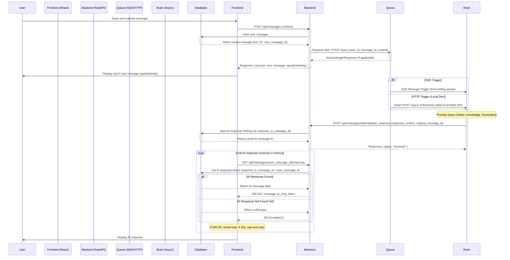

# Interaction Flow

This sequence diagram illustrates the core flow of sending a message and receiving a response:

```mermaid
sequenceDiagram
    participant User
    participant Frontend (React)
    participant Backend (FastAPI)
    participant Queue (SQS/HTTP)
    participant Brain (Async)
    participant Database

    User->>Frontend: Types and submits message
    Frontend->>Backend: POST /api/messages (content)
    activate Backend
    Backend->>Database: Save user message
    activate Database
    Database-->>Backend: Return saved message (incl. ID: user_message_id)
    deactivate Database
    Backend->>Queue: Enqueue task / POST /query (user_id, message_id, content)
    activate Queue
    Queue-->>Backend: Acknowledge/Response (if applicable)
    deactivate Queue
    Backend-->>Frontend: Response { success: true, message: savedUserMsg }
    deactivate Backend
    Frontend->>User: Display user's sent message (optimistically)

    %% --- Asynchronous Brain Processing ---
    alt SQS Trigger
        Queue->>Brain: SQS Message Trigger (from polling queue)
    else HTTP Trigger (Local Dev)
        Queue->>Brain: Direct POST /query (if Backend called local Brain API)
    end
    activate Brain
    Note over Brain: Process Query (Intent, Knowledge, Generation)
    Brain->>Backend: POST /api/messages/internal/brain_response (response_content, original_message_id)
    activate Backend
    Backend->>Database: Save AI response (linking via responds_to_message_id)
    activate Database
    Database-->>Backend: Return saved AI message ID
    deactivate Database
    Backend-->>Brain: Response { status: "received" }
    deactivate Backend
    deactivate Brain

    %% --- Frontend Polling for Specific AI Response ---
    loop Until AI response received or timeout
        Frontend->>Backend: GET /api/messages/{user_message_id}/response
        activate Backend
        Backend->>Database: Get AI response where responds_to_message_id = user_message_id
        activate Database
        alt AI Response Found
            Database-->>Backend: Return AI message data
            Backend-->>Frontend: 200 OK { message: ai_msg_data }
        else AI Response Not Found Yet
            Database-->>Backend: Return null/empty
            Backend-->>Frontend: 202 Accepted {}
        end
        deactivate Database
        deactivate Backend
        Note over Frontend: If 200 OK, break loop. If 202, wait and retry.
    end
    Frontend->>User: Display AI response

``` 